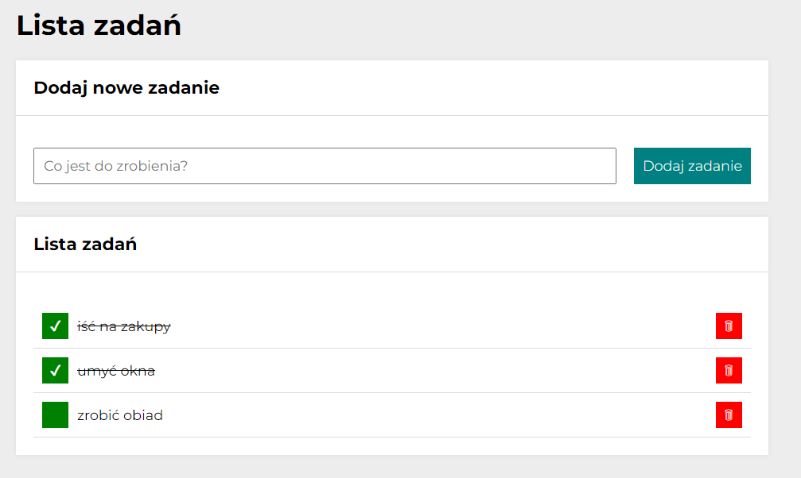

# To-Do-List Application

## Description
This is simple app created during YouCode course. It allows you for adding some new tasks, marking them as done or even removing from the list. 

## Demo
https://bras-klaudia.github.io/to-do-list/

## Technology
HTML, CSS, JavaScprit
